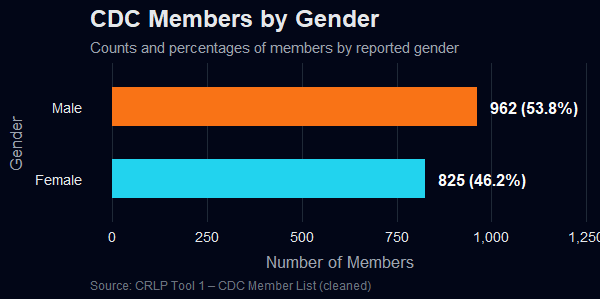
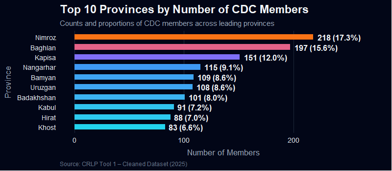
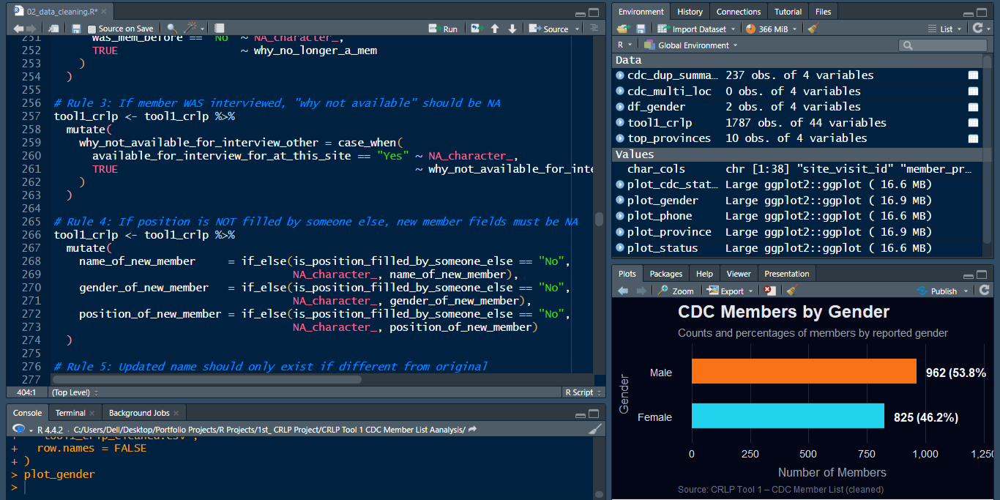
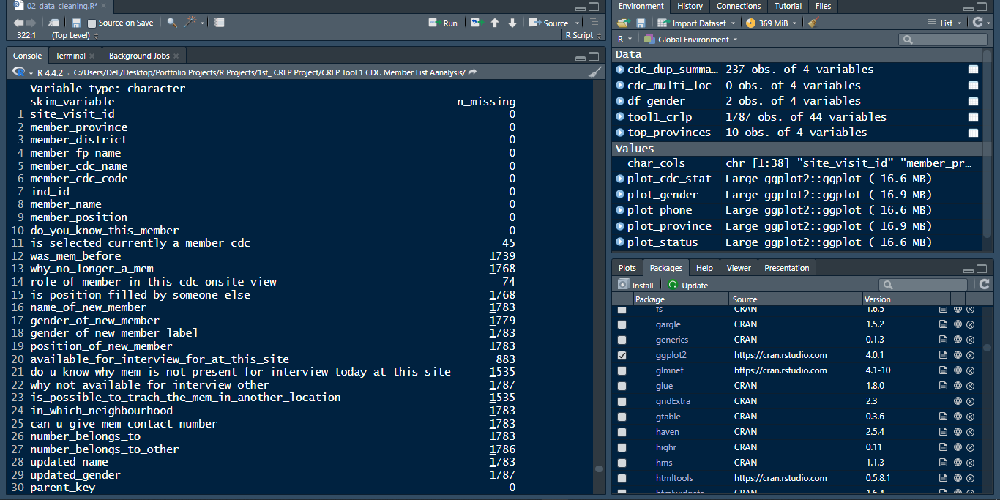
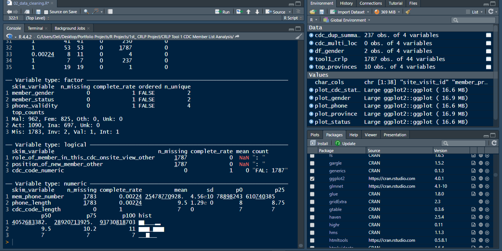

CRLP Tool 1 – CDC Member List Analysis

Data Cleaning • Quality Checks • Validation • Visualizations • R Programming

This project focuses on cleaning, and validating, the CDC Member List (Tool 1) as part of the CRLP monitoring workflow.
The analysis was performed in R, following a professional data-cleaning pipeline and using advanced visualizations.

CRLP-Data-Cleaning-Project/
|
├── data_raw/           # Original dataset (not uploaded due to sensitivity)
├── data_cleaned/       # Cleaned CSV + RDS dataset
├── r_scripts/          # R scripts used for cleaning and visualization
├── plots/              # High-resolution PNG visualizations
├── screenshots/        # RStudio screenshots for project steps
└── README.md           # Project documentation

Project Objectives

- Prepare a clean and verified CDC member dataset
Remove duplicates, correct inconsistencies, and standardize all fields to support reliable verification activities.
- Ensure data readiness for community-level validation
Clean member names, genders, roles, CDC codes, phone numbers, and membership status to ensure accurate identity tracing during site visits.
- Apply CRL business rules to enforce logical consistency
Align membership status, availability, updated fields, and new-member replacements with project requirements and verification logic.
- Support accurate sampling and monitoring
Provide a high-quality dataset so field teams and the Monitoring Agent can confirm CDC activity, women’s involvement, and beneficiary presence efficiently and correctly.
- Improve reliability of reporting to UNOPS and the World Bank
Produce a standardized dataset that feeds into monitoring dashboards, monthly briefs, and quarterly reports with confidence.

Data Cleaning Steps (Summary)

1. Load and inspect dataset
Imported Excel file using readxl
Cleaned column names with janitor::clean_names()

2. Remove noise
Removed empty rows
Removed duplicate records
Trimmed extra spaces
Standardized capitalization

3. Fix categorical fields
Standardized gender values
Cleaned Yes/No fields
Normalized member status (Active/Inactive)

4. Phone number validation
Removed non-numeric characters
Checked for correct length
Identified invalid and international formats
Standardized Afghan numbers (07XXXXXXXX)

5. CDC code validation
Checked length (must be 7 digits)
Checked if numeric
Identified duplicates and conflicts across locations

6. Consistency rules
Applied logic checks such as:
If member was interviewed → “why not available” = NA
If position not filled → new member fields must be NA
Updated name/gender must differ from original

Visualizations
Gender Distribution (Neon-Dark Style)
Top 10 Provinces by Member Count

All plots are generated in a modern neon-dark 2025 dashboard style using ggplot2.

How to Reproduce This Project
Clone the repository: git clone https://github.com/farhad-sahebi/CRLP-Data-Cleaning-Project.git
Install required R packages: install.packages(c("readxl", "dplyr", "janitor", "stringr", "ggplot2", "naniar", "skimr", "scales"))

Run the data-cleaning script: source("r_scripts/02_data_cleaning.R")

## Gender Distribution

## Top 10 Provinces

## RStudio Code Execution

